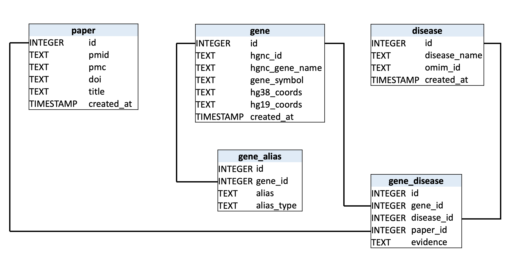
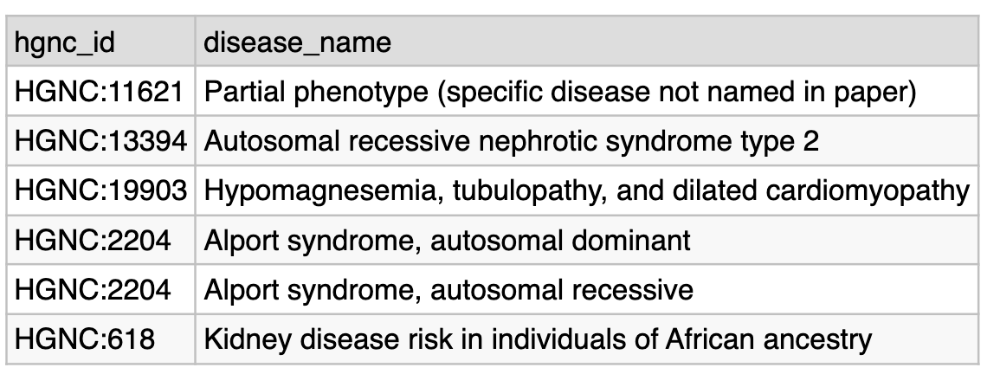
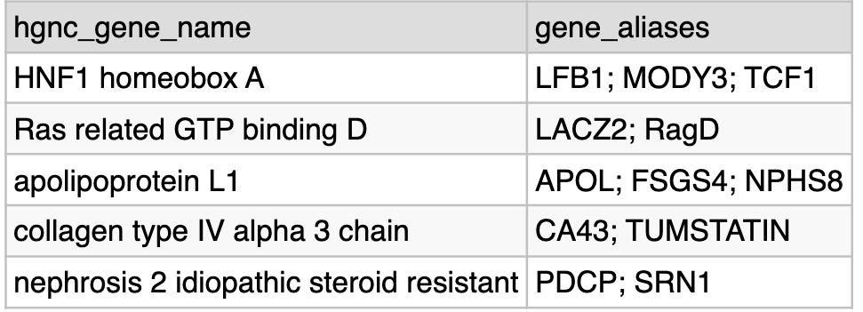

# BG_Technical_Assessment

---

## Part 1 — Data Retrieval, Parsing, and Transformation

### Paper

**Title:** Diagnostic yield of exome and genome sequencing after non-diagnostic multi-gene panels in patients with single-system diseases  
**PMID:** 38790019  
**PMC:** PMC11127317  
**DOI:** 10.1186/s13023-024-03213-x

`Part1.ipynb` code for Part 1

### Output

The output is a JSON file (`gene_output.json`) 

---

## Part 2 — Database

### Database

PostgreSQL 

### Schema



### Queries

**Query 1: HGNC ID and disease connection :**
```sql
SELECT
    g.hgnc_id,
    d.disease_name
FROM gene         g
JOIN gene_disease gd ON gd.gene_id   = g.id
JOIN disease      d  ON d.id         = gd.disease_id
ORDER BY g.hgnc_id, d.disease_name;
```


**Query 2: HGNC Gene Name and any gene name aliases parsed :**
```sql
SELECT
    g.hgnc_gene_name,
    STRING_AGG(ga.alias, '; ' ORDER BY ga.alias) AS gene_aliases
FROM gene            g
LEFT JOIN gene_alias ga ON ga.gene_id = g.id
GROUP BY g.id, g.hgnc_gene_name
ORDER BY g.hgnc_gene_name;
```

